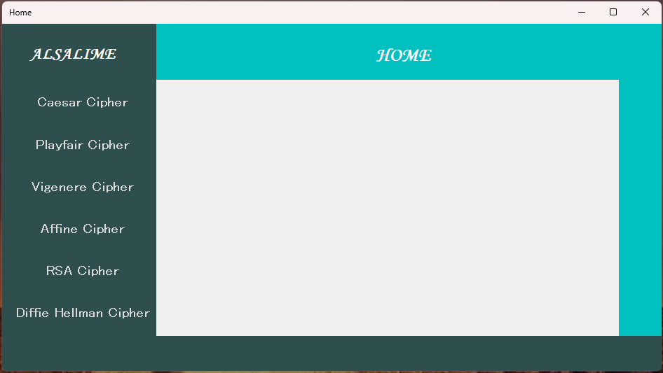
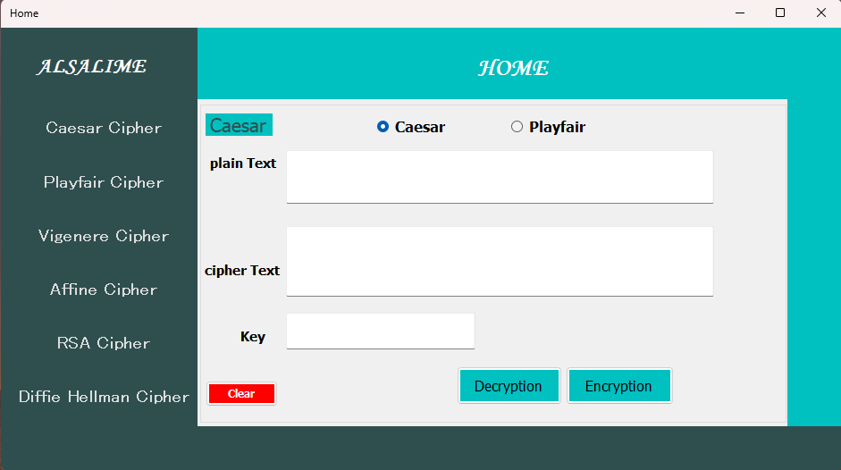
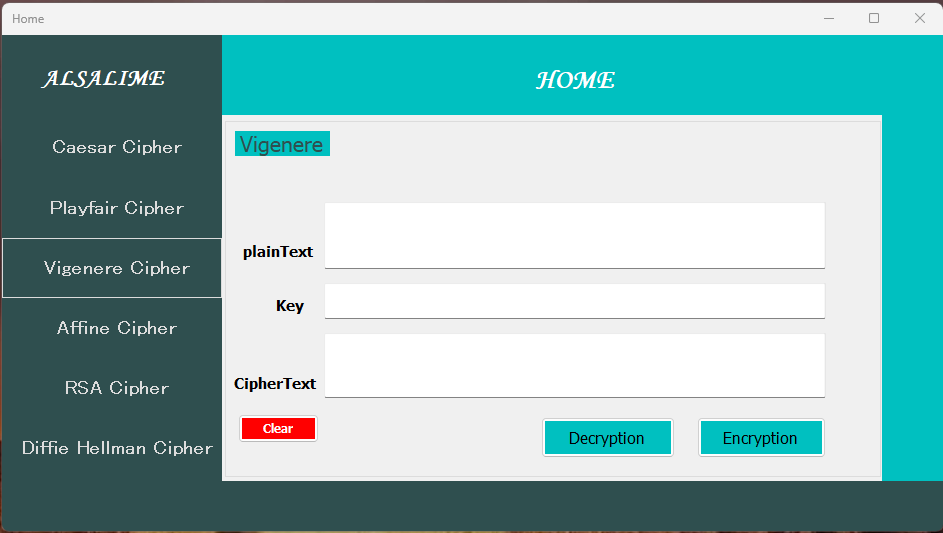
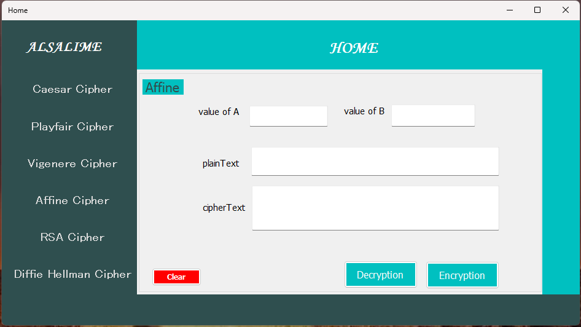
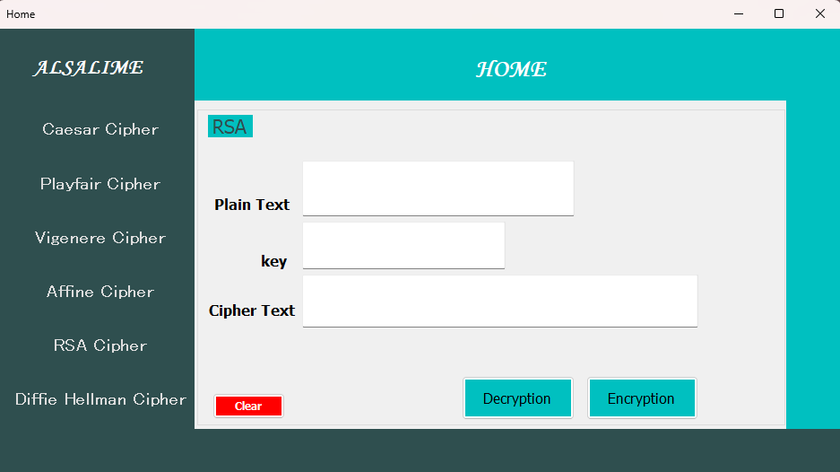
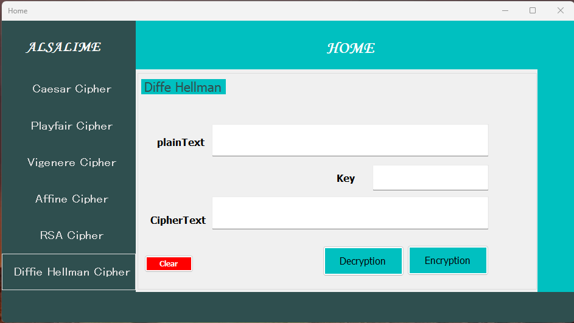

# 🔐 ENCRYPTION Project

تطبيق لتشفير وفك تشفير البيانات باستخدام عدة خوارزميات كلاسيكية وحديثة، تم تطويره باستخدام لغة C# وواجهة رسومية (Windows Forms).

---

## 🚀 الخوارزميات المدعومة

- 🔡 قيصر (Caesar Cipher)
- 🧮 بلايفير (Playfair Cipher)
- 📜 فيجنير (Vigenère Cipher)
- 🔁 إيفن (Even Cipher)
- 🔐 RSA (تشفير مفتاح عام وخاص)
- 🤝 ديفي-هيلمان (تبادل المفاتيح)

---

## 🖼️ صور من التطبيق

### 🏠 الواجهة الرئيسية  

---

### 🔡 تشفير وفك تشفير قيصر  
  

---

### 🧮 تشفير وفك تشفير بلايفير  
  

---

### 📜 تشفير وفك تشفير فيجنير  
  

---

### 🔁 تشفير وفك تشفير إيفن  
  

---

### 🔐 تشفير وفك تشفير RSA  
  

---

### 🤝 تبادل المفاتيح باستخدام ديفي-هيلمان  

---

## 🧩 كيف تستخدم المشروع

1. افتح المشروع باستخدام **Visual Studio**
2. شغل `MainForm.cs`
3. اختر الخوارزمية المطلوبة وقم بعملية التشفير أو فك التشفير

---

## 👨‍💻 المطور

**الاسم:** malsalimi  
**GitHub:** [https://github.com/malsalimi](https://github.com/malsalimi)

---

## ⚖️ الرخصة

هذا المشروع لأغراض تعليمية فقط.
